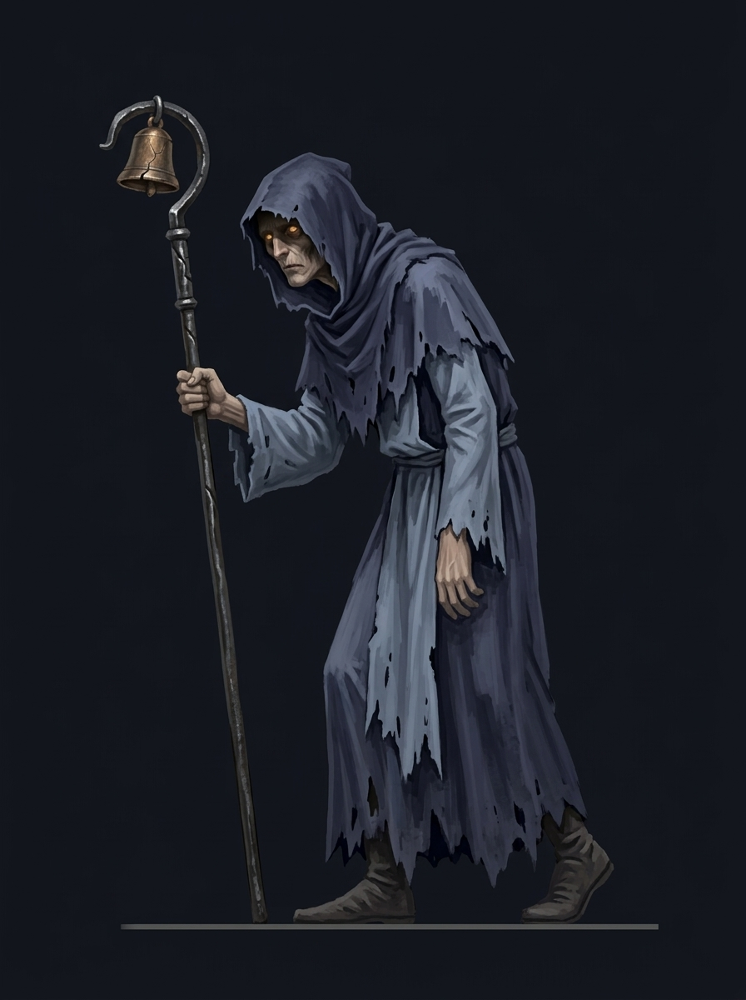

# Concept catalog

## The Abbey Gate — v001

First environment study for the proposed painted Gothic direction. Cool moonlight, weathered abbey architecture, and amber gate lanterns frame a continuous horizontal walking surface.

Status: concept for review. This is one flattened image, not a tile set or separated environment kit. Actual dimensions and checksum are recorded in `../manifest.json`.

Next review: contrast at gameplay scale, protagonist silhouette against the gate, and which architectural elements should become reusable modules.

## The Hollow Pilgrim — v001

First hostile character design study fulfilling M0/M2 roadmap requirements. Emaciated wandering penitent cloaked in tattered dark indigo and moonlit slate vestments (`#333D58`, `#8292A6`), deep facial shadow hiding hollow amber eyes (`#D99A52`), bearing a weathered wrought-iron processional staff topped with a cracked bronze bell.

Status: concept for review. Orthographic side profile designed for 2D platforming collision and pacing. Clean negative space between staff, cowl, and limbs ensures readability against dark background recesses. Multi-pose sprite sheet (idle, shuffle, staff swing, hit recoil, perish) planned upon silhouette sign-off.

