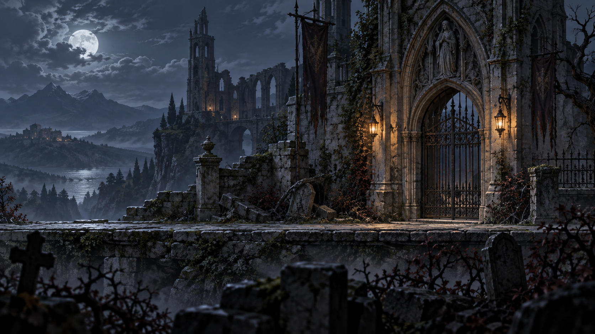

# Concept catalog

## The Abbey Gate — v001

First environment study for the proposed painted Gothic direction. Cool moonlight, weathered abbey architecture, and amber gate lanterns frame a continuous horizontal walking surface.

Status: concept for review. This is one flattened image, not a tile set or separated environment kit. Actual dimensions and checksum are recorded in `../manifest.json`.

Next review: contrast at gameplay scale, protagonist silhouette against the gate, and which architectural elements should become reusable modules.
