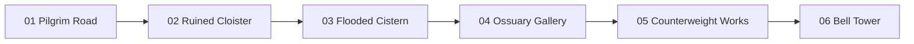

# Build the whole Ashen Vesper world

Ashen Vesper is an original Gothic action-platformer inspired by classic side-scrolling adventures. Help build a connected world from **room layouts, reusable environment modules, separate moving props and tested encounters**. All stages below are planning targets except the existing Pilgrim Road. A concept image or stitched panorama does not complete a stage.

**Layout baseline:** start with the [six concrete stage examples](examples/README.md), [neutral scrolling preview](examples/v001/preview.html) and per-stage JSON/instructions. Preserve supplied geometry first; invent the HD artwork from written themes, then record layout changes in v002. These examples supersede earlier freeform envelopes for baseline work.

Start by choosing **one stage and one deliverable**. You can contribute useful layouts, preview tools, integration code or asset cleanup without generating any images. Keep generation attempts focused on missing production pieces.

## World route and stage jobs



These arrows are proposed stage portals. They do not claim continuous geographic adjacency. Optional loops belong inside stage layouts; sanctuary/checkpoint returns need explicit links.

| Stage / copyable prompts | Planning bounds | First useful contribution | Dependencies |
| --- | --- | --- | --- |
| [01 Pilgrim Road](stages/01-pilgrim-road.md) | Baseline13920×1360; demo6400×720 | Document existing room graph or one causeway cap | Preserve current gameplay |
| [02 Ruined Cloister](stages/02-ruined-cloister.md) | 8192×2640 baseline | Six-room blockout; one arch OR pier | Room transition; moth/vial/lever behavior |
| [03 Flooded Cistern](stages/03-flooded-cistern.md) | 14336×2000 baseline | Dry-route/valve blockout; one damp cap | Valves, lift, Lurker motion/contact |
| [04 Ossuary Gallery](stages/04-ossuary-gallery.md) | 16012×1168 baseline | Three-room room graph; one niche wall | Vertical camera; Sexton motion/contact |
| [05 Counterweight Works](stages/05-counterweight-works.md) | 9216×2640 baseline | Lift-path blockout; one separate deck | Platform carrying and safe reversals |
| [06 Bell Tower](stages/06-bell-tower.md) | 11944×2000 baseline | Ascending route/arena blockout; one landing | Vertical camera/lifts; boss later |

[world-plan.json](world-plan.json) records IDs, planned bounds, room budgets and portal order. The baseline has 3–6 functional rooms per stage, not a requirement to make one huge PNG per room. Room boundaries follow safe transition, camera and encounter purposes. This plan is independent of the runtime's current fixed-level constants.

Build order differs from route order: finish current animation/gate continuity; connect the Cloister; prove lever/grate, vial and moth; prove Sexton/lift; then Cistern and later multi-band stages. Contributors may prepare later layouts/asset candidates now, labelling their dependencies. See the [future queue](../FUTURE_CONTENT.md).

## How contributors can help

| Lane | Submit in one bounded PR | Acceptance evidence |
| --- | --- | --- |
| World planning | Stage graph, entrance/exit anchors, safe main route, optional loop | IDs resolved; portal versus spatial seam explicit |
| Stage blockout | JSON geometry and scrolling rectangle preview | Traverse/return/checkpoint evidence; feature gaps labelled |
| Environment art | One missing module or small compatible pair | Actual dimensions/alpha/anchors and runtime composites |
| Background art | One separated distant layer after layout | Parallax/layer order, scroll ends and seams demonstrated |
| Mechanism art | Separate grate, deck, chain or weight | Sockets and moving/stationary separation |
| Enemy motion | Motion using a selected reference | Stable anatomy, anchored playback and contact guides |
| Integration/code | Layout adapter, one transition or one behavior | Existing route preserved; actual control tests |
| Tools/cleanup | Layout validation, assembly preview, versioned export cleanup | Original retained; useful errors or visible improvement |

**Good claim:** “Stage 02 / arcade pier / v001; missing module; 1024 RGBA →240 units; ground pivot (512,960); alpha/openings and runtime preview.”

**Good no-generation claim:** “Stage 03 / four-room dry-route blockout; explicit water hazards and two valve links; lift behavior marked pending.”

PR title: `World NN — bounded deliverable — candidate` or `World NN — bounded deliverable — integration`. State the stage ID and existing specialist job ID where relevant. Check open PRs/library before beginning to avoid duplicate attempts. Do not bundle all six stages or unrelated new systems into one PR.

## Project reference pack

Attach/reference the relevant retained project files and record their filenames in the exact prompt:

- [Abbey mood reference](../../art/concepts/abbey-gate-concept-v001.png): lighting and material direction; flattened concept, not a production background kit.
- [Retained masonry](../../art/production/abbey/masonry-module-v001.png): worn stone scale; existing keyed source needs its runtime preparation, not a raw alpha claim.
- [Hero motion metadata](../../art/production/bellwarden/bellwarden-pilot-v001.json) and [hero sheet](../../art/production/bellwarden/bellwarden-pilot-v001.png): real frame crop/anchor/scale for assembled comparisons; magenta-key source.
- [Selected moth](../../art/contributions/11-bell-moth/v001/exports/bell-moth-v001.png), [Sexton](../../art/contributions/12-iron-sexton/v001/exports/iron-sexton-v001.png) and [Lurker](../../art/contributions/13-cistern-lurker/v001/exports/cistern-lurker-v001.png): reference silhouettes for encounter space, not finished enemy animation.
- [Vial](../../art/contributions/14-pickups-and-relics/v001/exports/healing-vial-v001.png) and [lever states](../../art/contributions/15-mechanisms/v001/exports/lever-v001.png): prop material references and planned placements.

See [the catalog](../../art/manifest.json) for alpha/status/limitations and [the library](../../art/library/gallery.html) for corrected preview links. Include only relevant references in a generation job.

## Production sequence for each stage

1. **Inventory:** reuse catalogued masonry, sky, gate, brazier, ember and selected references. List each missing piece with intended placement, layer and runtime size. Selected vial, moth, Sexton and Lurker references do not yet supply their future gameplay. The retained lever has missing-attempt preservation follow-up; see [PRs 15–17](../PR_15_17_REVIEW.md).
2. **Layout:** produce a blockout from the supplied baseline room graph using the [layout contract](LAYOUT_CONTRACT.md). Name entry/exit/checkpoint anchors, solid geometry, encounter spaces, mechanism links and camera bounds. Validate travel before polishing backgrounds.
3. **Art direction:** use retained project references first. If a concept is useful, produce one stage mood reference with its intended production uses recorded. It is optional, never collision data and never automatically tileable.
4. **Small kit:** generate/export one needed module. Test it at actual hero scale and assembled placement. Reuse that piece across the stage before commissioning another near-duplicate. Distinctive room identity can come from lighting/background/props while floors keep coherent materials.
5. **Layer assembly:** submit a source/runtime scrolling preview with normal source-over compositing, grayscale, collision overlay and alpha tests. Separate background architecture, solid-aligned stone, props, moving objects and foreground.
6. **Integration:** load room data, bind selected art and implement only the declared behavior. Test full main path, optional return, death/checkpoint, revisits and restart. A layout may be retained as planning-only before its runtime dependencies exist.

Acceptance states are distinct: **retained candidate → selected prototype direction → usable export → integrated stage**. Keep limitations visible in the catalog/review. Merging a submission preserves resources; it does not certify gameplay readiness.

## Exact shared asset defaults

Specialist briefs take precedence for their named assets. For ordinary new architecture, these defaults apply:

| Module | Export / runtime | Anchor and requirements |
| --- | --- | --- |
| Pier, arch span, door surround | 1024×1024 RGBA /240×240 canvas | Uniform scale 240/1024; ground pivot (512,960); ≥16px clear padding; opening bounds and sockets |
| Walkable platform/landing cap | 1024×256 RGBA /240×60 canvas | Uniform scale 240/1024; painted top source y=32; underside/sockets explicit; ≥16px outer padding |
| Distant arcade/vault/shaft layer | 2048×1024 /1280×640 canvas | Uniform scale .625; proposed parallax .45; RGBA for separated architecture, opaque only for declared complete background |
| Optional prop/niche panel | Declare exact canvas/runtime before generation | Uniform scale, measured visible bounds, ground or attachment pivot, layer purpose, padding and alpha policy |
| Sky/environment reference | 2048×1024 horizontal or1024×1536 vertical, opaque | Concept/background purpose explicit; no collision or tiling claim |

Mechanism sizes and sockets are in [Job 15](../art-jobs/15-mechanisms.md); cistern water strip in [Job 09](../art-jobs/09-flooded-cistern.md); tower bell in [Job 10](../art-jobs/10-bell-tower.md). Existing alpha-padded caps are placed with recorded sockets; repeating full transparent canvases can create gaps. If a piece is meant to tile, define the actual repeat interval and show three copies. An overlap joint must not change collision thickness or create a dark double-opacity band.

**Measure the visible silhouette.** Canvas dimensions include padding. Hero artwork nominal standing height is144; current collision height is120 standing /84 crouched. Do not render a random hero crop and label it144. Use existing frame metadata and runtime scale. Use one uniform scale; never squash a character to meet a width/height label. Black/white/cold-blue tests expose matte boxes and dark fringes hidden against scenery.

## Copyable assembly/code prompt

> Build a browser scrolling blockout/assembly preview for one Ashen Vesper stage using its original layout JSON and catalogued art. Follow docs/world/LAYOUT_CONTRACT.md. Show room IDs, entry/exit feet anchors, checkpoints, solids, hazards, proposed encounter bounds and visible camera clamps. Provide normal/grayscale, collision guides and source/runtime size modes; allow inspection of every room without hiding discontinuities with automatic recentering. Use real hero frame metadata and scale. Validate both coordinates of spatial seams, safe portal destinations, re-entry cycles and shared-space ownership. Show three-copy seams for repeating modules, foreground readability and parallax at both scroll limits. Reuse retained assets or labelled rectangles when missing art/behavior would otherwise block the preview. Mark unsupported runtime features. Do not change jump/crouch physics to conceal layout failures. Submit actual traverse/return evidence separately from a freely panned planning preview.

Stage-specific generation prompts are in the six briefs above. Replace the module placeholder with one exact piece, record dimensions and anchors, and include the selected project-reference filenames. Record the exact prompt actually sent, including edits and negative constraints; do not substitute an earlier idealized prompt afterward.

## Submission folders and preservation

For new world jobs:

```text
art/contributions/world-02-ruined-cloister/v001/
  source/                  # every untouched generation attempt, including rejects
  exports/                 # selected production cutouts/layers
  layout.json              # optional layout candidate; planning/runtime status explicit
  PROMPT.txt               # exact prompts, per attempt and reference filenames
  NOTES.md                 # model/tool, attempts, cost, method, limitations
  submission.json          # geometry, anchors, sockets, scale, links and hashes
  preview.html             # interactive or scrolling evidence
  evidence/                # source/runtime composites and seam screenshots
```

Existing numbered specialist jobs use their existing contribution directory instead of creating a duplicate world copy. Reference existing asset IDs. Layout-only work can use `docs/world/contributions/STAGE-ID/v001/` with layout, preview/evidence and notes; no fake generation prompt or cost is needed.

Register every new PNG in `art/manifest.json`, and every source/variant/prompt/metadata/preview resource in `art/library/submissions.lock.json`. Add gallery links when images are submitted. Preserve all originals, rejected attempts and earlier variants byte-for-byte. Cleanup goes into v002+, never overwrites a locked v001. Asset `submission.json` must record actual source/export SHA-256, canvas/cell geometry, visible bounds, scale, pivots, sockets, alpha/seam policy, status and implementation gaps.

Use the [copyable PR body](templates/PR_BODY.md) to report the concrete deliverable and its gaps.

## Checks and PR checklist

- **Layout:** resolve IDs/references, safe spawn/headroom, main/optional route, both-axis seams, portal destination, shared-space ownership and camera bounds. Current project has no world-layout loader/validator yet; provide a bounded validator/adapter PR or record manual checks honestly. Do not claim the character-sheet validator supports world maps.
- **Art:** dimensions and measured alpha padding; true openings; full silhouette; runtime hero/enemy scale; no matte rectangle; normal/grayscale white/black/blue/stage composites. Inspect edges at1× runtime and source size.
- **Repeat/layers:** three-copy horizontal/vertical seams as applicable, sockets/repeat interval, no lighting jump, actor/floor readability, both scroll limits. Whole-stage output is an assembly preview, not a replacement for reusable exports.
- **Gameplay integration:** route, optional return, keyboard/gamepad/narrow touch, both camera presets, solid sides/undersides, checkpoint after death, revisits with no duplicate pickup/enemy reset, restart, visible gate/lever link and camera-safe destination. Vertical/lift stages also test landing visibility, grounded carrying, jump-off, reversal and safe respawn.
- Run `npm test` and `npm run validate:assets` for submissions; `npm run test:browser` when gallery/preview/study changes; `npm run test:encounter` for gameplay changes and required regression checks. New controls/behavior need meaningful focused tests and actual input evidence. Passing the old encounter does not prove a new map is integrated.
- PR body includes delivered files, reuse versus newly generated assets, model/attempt count per item, exact known cost or “unknown,” checks/failures, acceptance status and remaining dependencies. Unknown cost is not zero. No new generation is needed for blockout, validation or transition code.

**Start now:** Stage02 baseline room graph/blockout; reuse retained Cloister arch/pier with corrected sockets; separated grate; selected moth motion; vial inventory/use implementation; missing lever attempt preservation. These together can complete a coherent next encounter before later-stage art expands.

## Latest contribution review

PRs 18–21: arcade arch is now distant demo scenery and a cropped cap is prototype floor material. Stair candidate has141.5 socket rise rather than224; structural arch/cap sockets do not match. See [review and contributor follow-ups](../PR_18_21_REVIEW.md) before extending the kit.
